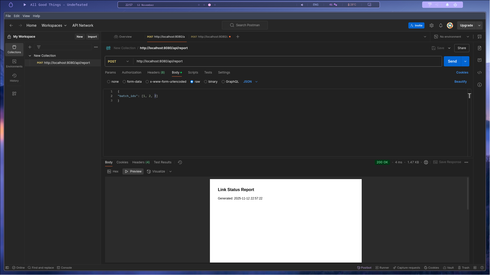
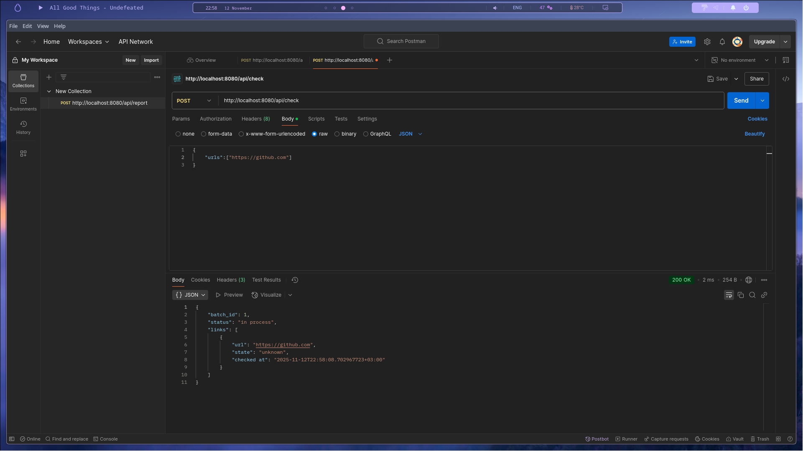
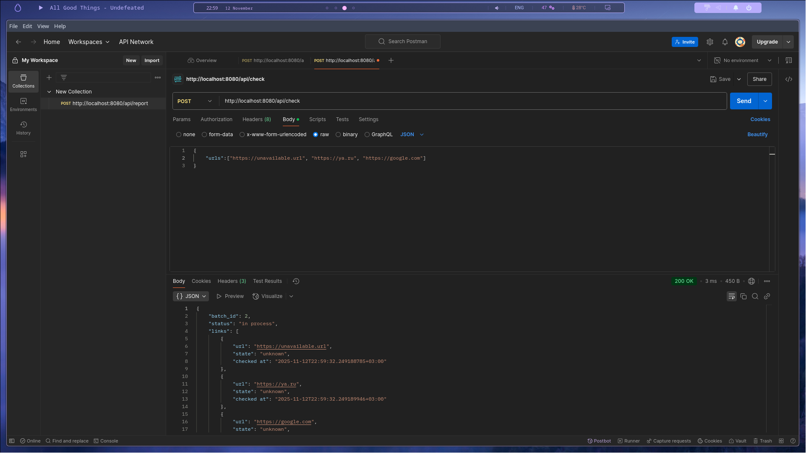
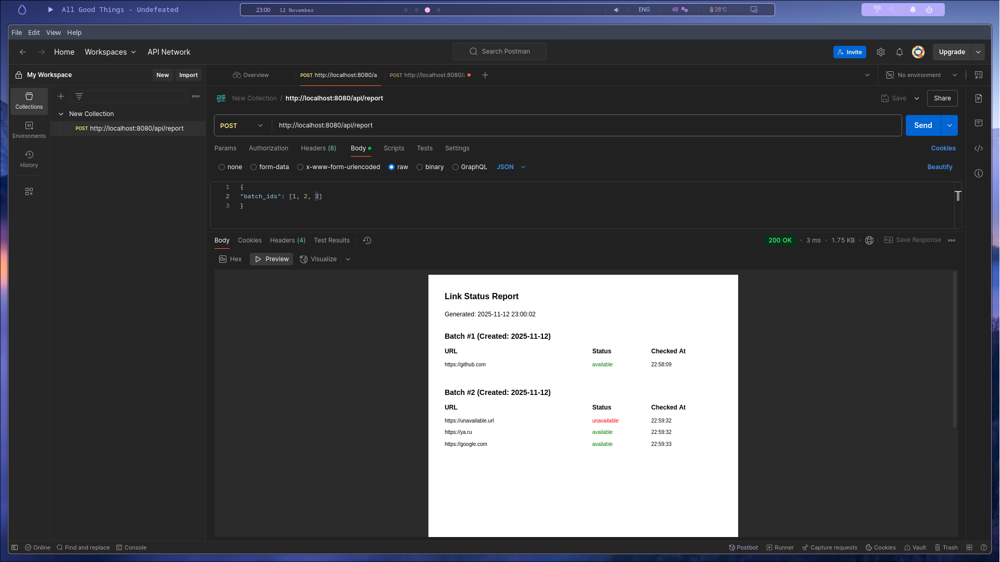

# Это небольшой проект для собеседования на Golang
## План разработки
1. Создал основные структуры, такие как ссылка, репозиторий и пачка. обозначил их простейшую логику вщаимодействия и конструкторы
2. Добавил работу с файлами в проект. Теперь я мог сохранять репозиторий в json формате и выводить pdf отчет о пачках
3. Дальше я на эту базу нарастил rest API логику, используя базовые net/http и go-chi/chi/v5
4. Тут мне было необходимо добавить асинхронность в работе с сылками, разбивая проверку пачки на атомарные операции
5. И под финал я добавил сохранение прогресса при завершении работы сервиса, сохраняя репозиторий в уже упомянутый json

## Работа сервиса
Как уже было понятно, все, что делает сервис, это принимает пачку из одной или нескольких ссылок и проверяет их доступность, формируя отчет по пачкам.
При получении  пачки ссылок мы помещаем их в специальную структуру - репозиторий, что потом формирует очередь проверки ссылок на доступность. 
Реализованно это по передаче по каналу структуры задачи, что хранит базовую информацию о каждой отдельной ссылке
Запросы реализуются через json вот пример в программе Postman

Чтобы получить отчет в pdf формате мы задаем ID тех пачек что мы хотим проверить в формате массива
Вот как будет выглядеть отчет когда мы еще не задали ни одной пачки ссылок для проверки

Точно так же чтобы отправить ссылки на проверку мы принимаем их в формате массива строк-url, вот так отправляется одна ссылка

Но можно отправить и несколько

После того как мы отправили ссылки на проверку мы можем получить по ним отчет в pdf формате

